# 客户转化SOP流程图

> 本流程图展示从潜在客户初次接触到大货订单签署的完整业务流程

## 完整流程图

```mermaid
flowchart TD
    %% ==================== 阶段一：客户获取与分类 ====================
    subgraph Phase1["阶段一：客户获取与分类"]
        A1[/"潜在客户联系<br/>表单/ChatBot/邮件/WhatsApp"/]
        A2{"是否在<br/>工作时间?"}
        A3["几小时内回复<br/>记录客户信息"]
        A4["发送自动回复<br/>次日详细回复"]
        A5["创建客户档案<br/>录入Notion/CRM"]
        A6{"客户资格评估<br/>分配优先级"}
    end

    A1 --> A2
    A2 -->|是| A3
    A2 -->|否| A4
    A3 --> A5
    A4 --> A5
    A5 --> A6

    %% ==================== 客户分类处理 ====================
    subgraph ClassA["A类：现有客户"]
        B1["最高优先级<br/>快速响应"]
        B2["对照历史订单<br/>分析新需求"]
        B3["提供定制化服务<br/>快速打样/优惠价格"]
    end

    subgraph ClassB["B类：高意向新客户"]
        C1["立即发送详细答复<br/>介绍公司优势"]
        C2["安排Zoom会议<br/>深入了解需求"]
        C3["准备案例/资质<br/>建立信任"]
    end

    subgraph ClassC["C类：需培养客户"]
        D1["提供价值内容<br/>成功案例/行业趋势"]
        D2["每1-2周跟进<br/>询问项目进展"]
        D3["摸清决策流程<br/>邀请试用服务"]
    end

    subgraph ClassD["D类：低意向客户"]
        E1["礼貌回复基本信息<br/>提供公司介绍"]
        E2["加入邮件列表<br/>偶尔群发新品"]
        E3["标记低优先级<br/>待需求转变"]
    end

    A6 -->|A类| B1
    A6 -->|B类| C1
    A6 -->|C类| D1
    A6 -->|D类| E1

    B1 --> B2 --> B3
    C1 --> C2 --> C3
    D1 --> D2 --> D3
    E1 --> E2 --> E3

    %% ==================== 阶段二：会议与沟通 ====================
    subgraph Phase2["阶段二：会议与沟通"]
        F1{"客户预约<br/>会议/参观?"}
        F2["确认日程<br/>发送会议邀请"]
        F3["准备议程提纲<br/>问题清单"]
        F4["工厂视频参观<br/>测试设备/网络"]
        F5["整理销售资料<br/>公司简介/案例/证书"]
        F6["准备定制化提案<br/>初步报价方案"]
    end

    B3 --> F1
    C3 --> F1
    D3 -.->|"需求明确后"| F1

    F1 -->|是| F2
    F1 -->|否| F5
    F2 --> F3
    F3 -->|Zoom会议| F5
    F3 -->|工厂参观| F4
    F4 --> F5
    F5 --> F6

    %% ==================== 阶段三：首次沟通会议 ====================
    subgraph Phase3["阶段三：首次沟通会议"]
        G1["开场自我介绍<br/>寒暄"]
        G2["倾听客户需求<br/>记录要点"]
        G3["介绍核心优势<br/>安全/价格/沟通"]
        G4["解答客户问题<br/>未决问题会后反馈"]
        G5["确认下一步行动<br/>时间表"]
    end

    F6 --> G1
    G1 --> G2 --> G3 --> G4 --> G5

    %% ==================== 阶段四：会后跟进 ====================
    subgraph Phase4["阶段四：会后跟进与报价"]
        H1["24小时内发送<br/>跟进邮件"]
        H2["提供未决问题答复<br/>相关资料附件"]
        H3["更新客户档案<br/>记录会议详情"]
        H4["确认需求细节<br/>设计稿/数量/材料"]
        H5{"需求是否<br/>完善?"}
        H6["提供专业建议<br/>协助完善方案"]
        H7["内部核算成本<br/>工厂沟通评估"]
    end

    G5 --> H1
    H1 --> H2 --> H3 --> H4 --> H5
    H5 -->|否| H6
    H6 --> H4
    H5 -->|是| H7

    %% ==================== 阶段五：报价与打样 ====================
    subgraph Phase5["阶段五：报价与打样"]
        I1["准备正式报价单<br/>价格/交期/付款条款"]
        I2["发送报价与方案<br/>突出价值主张"]
        I3{"客户反馈"}
        I4["样品制作<br/>1-2周周期"]
        I5["发送样品照片/视频<br/>客户预览"]
        I6["快递实物样品<br/>客户确认"]
        I7{"样品是否<br/>确认?"}
        I8["记录修改意见<br/>评估二次打样"]
        I9["提供修正后报价<br/>锁定最终价格"]
    end

    H7 --> I1
    I1 --> I2 --> I3
    I3 -->|需要打样| I4
    I3 -->|直接报价| I9
    I4 --> I5 --> I6 --> I7
    I7 -->|否| I8
    I8 --> I4
    I7 -->|是| I9

    %% ==================== 阶段六：建立信任与跟进 ====================
    subgraph Phase6["阶段六：信任建立与跟进"]
        J1["展示公司实力<br/>ISO证书/成功案例"]
        J2["解释品质控制<br/>AQL检验/100%成品检"]
        J3["强调财务运营稳健<br/>供货安全"]
        J4{"客户是否<br/>决策?"}
        J5["每1-2周礼貌跟进<br/>询问进展"]
        J6["关注客户公司动态<br/>把握时机"]
        J7["协助向决策者<br/>提供方案说明"]
    end

    I9 --> J1
    J1 --> J2 --> J3 --> J4
    J4 -->|未决策| J5
    J5 --> J6 --> J7 --> J4

    %% ==================== 阶段七：合同谈判 ====================
    subgraph Phase7["阶段七：合同谈判"]
        K1{"客户对报价<br/>有异议?"}
        K2["倾听客户关注点<br/>价格/交期/条款"]
        K3["探讨灵活方案<br/>阶梯折扣/材料调整"]
        K4["提供数据支撑<br/>证明价值"]
        K5["合作共赢态度<br/>适当让步"]
        K6["记录讨论结果<br/>更新合同条款"]
        K7{"达成一致?"}
    end

    J4 -->|准备下单| K1
    K1 -->|有异议| K2
    K1 -->|无异议| L1
    K2 --> K3 --> K4 --> K5 --> K6 --> K7
    K7 -->|否| K2
    K7 -->|是| L1

    %% ==================== 阶段八：订单确认 ====================
    subgraph Phase8["阶段八：订单确认"]
        L1["准备正式合同<br/>规格/数量/价格/条款"]
        L2["双方签署合同"]
        L3["收取预付款<br/>约50%订金"]
        L4["客户提供PO<br/>正式采购订单"]
        L5["更新订单状态<br/>标记已确认"]
        L6["通知工厂团队<br/>准备生产"]
    end

    L1 --> L2 --> L3 --> L4 --> L5 --> L6

    %% ==================== 阶段九：生产准备 ====================
    subgraph Phase9["阶段九：生产准备"]
        M1["采购部下单原材料<br/>跟踪到厂时间"]
        M2["生产部排产计划<br/>确定开工日期"]
        M3["质检团队沟通<br/>特殊质量要求"]
        M4["制定生产进度计划<br/>里程碑时间节点"]
        M5["发送进度表给客户<br/>确认生产周期"]
    end

    L6 --> M1
    M1 --> M2 --> M3 --> M4 --> M5

    %% ==================== 阶段十：生产与质检 ====================
    subgraph Phase10["阶段十：生产与质检"]
        N1["生产进行中"]
        N2["定期更新进度<br/>附照片/视频"]
        N3{"生产是否<br/>有异常?"}
        N4["第一时间告知客户<br/>说明应对方案"]
        N5["生产完成"]
        N6["内部质检<br/>AQL 2.5抽检"]
        N7{"客户是否<br/>验货?"}
        N8["配合客户/第三方<br/>验厂抽检"]
        N9["提供质检报告<br/>客户备案"]
    end

    M5 --> N1
    N1 --> N2 --> N3
    N3 -->|是| N4
    N4 --> N1
    N3 -->|否| N1
    N1 -->|"达到里程碑"| N2
    N2 -->|"生产完成"| N5
    N5 --> N6 --> N7
    N7 -->|是| N8
    N8 --> N9
    N7 -->|否| N9

    %% ==================== 阶段十一：发货交付 ====================
    subgraph Phase11["阶段十一：发货交付"]
        O1["收取尾款<br/>发货前付清"]
        O2["联系货代订舱<br/>安排运输"]
        O3["准备出货文件<br/>发票/装箱单/原产地证"]
        O4["通知客户提单号<br/>预计到达时间"]
        O5["跟踪运输状态<br/>协助报关问题"]
        O6["确认货物送达<br/>初步验收满意度"]
    end

    N9 --> O1
    O1 --> O2 --> O3 --> O4 --> O5 --> O6

    %% ==================== 阶段十二：复盘与维护 ====================
    subgraph Phase12["阶段十二：复盘与客户维护"]
        P1["发送感谢信<br/>确认满意度"]
        P2{"客户是否<br/>满意?"}
        P3["制定补救措施<br/>补发/技术支持"]
        P4["邀请客户反馈<br/>改进建议"]
        P5["内部复盘会议<br/>总结经验教训"]
        P6["更新客户状态<br/>已成交"]
        P7["评估长期潜力<br/>制定跟进策略"]
    end

    O6 --> P1 --> P2
    P2 -->|否| P3
    P3 --> P4
    P2 -->|是| P4
    P4 --> P5 --> P6 --> P7

    %% ==================== 阶段十三：长期关系维护 ====================
    subgraph Phase13["阶段十三：长期关系维护"]
        Q1["每季度业务回顾<br/>新品推介"]
        Q2["重大节日问候"]
        Q3["分享行业资讯<br/>邀请年度考察"]
        Q4["关注市场动态<br/>探讨新合作"]
        Q5["建立战略伙伴关系<br/>争取复购"]
    end

    P7 --> Q1
    Q1 --> Q2 --> Q3 --> Q4 --> Q5
    Q5 -.->|"新需求"| A1

    %% ==================== 低意向客户转化路径 ====================
    E3 -.->|"需求转变"| A6

    %% ==================== 样式定义 ====================
    classDef phaseStyle fill:#e3f2fd,stroke:#1565c0,stroke-width:2px
    classDef decisionStyle fill:#fff8e1,stroke:#f57f17,stroke-width:2px
    classDef classAStyle fill:#e8f5e9,stroke:#2e7d32,stroke-width:2px
    classDef classBStyle fill:#fff3e0,stroke:#ef6c00,stroke-width:2px
    classDef classCStyle fill:#f3e5f5,stroke:#7b1fa2,stroke-width:2px
    classDef classDStyle fill:#eceff1,stroke:#546e7a,stroke-width:2px

    class Phase1,Phase2,Phase3,Phase4,Phase5,Phase6,Phase7,Phase8,Phase9,Phase10,Phase11,Phase12,Phase13 phaseStyle
    class A2,A6,F1,H5,I3,I7,J4,K1,K7,N3,N7,P2 decisionStyle
    class ClassA classAStyle
    class ClassB classBStyle
    class ClassC classCStyle
    class ClassD classDStyle
```

---

## 流程概览

### 13个主要阶段

| 阶段 | 名称 | 核心任务 | 关键产出 |
|:---:|------|----------|----------|
| 1 | 客户获取与分类 | 接收询盘、记录信息、分类评估 | 客户档案、优先级标签 |
| 2 | 会议与沟通 | 预约确认、准备资料 | 议程提纲、销售资料 |
| 3 | 首次沟通会议 | 倾听需求、介绍优势 | 会议记录、下一步计划 |
| 4 | 会后跟进与报价 | 跟进邮件、确认需求 | 完整需求文档 |
| 5 | 报价与打样 | 报价单、样品制作 | 确认样品、最终报价 |
| 6 | 信任建立与跟进 | 展示实力、持续跟进 | 客户信任、决策推进 |
| 7 | 合同谈判 | 协商条款、灵活方案 | 双方认可的条款 |
| 8 | 订单确认 | 签署合同、收取订金 | 正式合同、PO |
| 9 | 生产准备 | 采购原料、排产计划 | 生产进度表 |
| 10 | 生产与质检 | 生产监控、质量检验 | 质检报告 |
| 11 | 发货交付 | 收尾款、发货跟踪 | 出货文件、送达确认 |
| 12 | 复盘与维护 | 满意度确认、内部复盘 | 经验总结、客户状态更新 |
| 13 | 长期关系维护 | 定期回顾、争取复购 | 长期合作关系 |

---

### 客户分类标准 (A/B/C/D)

| 分类 | 定义 | 特征 | 跟进策略 |
|:---:|------|------|----------|
| **A类** | 现有客户 | 曾有合作、信任度高 | 最高优先级、快速响应、定制化服务 |
| **B类** | 高意向新客户 | 明确需求、积极互动 | 紧密跟进、快速响应、建立信任 |
| **C类** | 需培养客户 | 潜在需求、决策流程长 | 持续联系、提供价值、培养兴趣 |
| **D类** | 低意向客户 | 意愿不强、短期无计划 | 基础回复、偶尔跟进、保持联系 |

---

### 8个关键决策点

```mermaid
flowchart LR
    D1["1. 工作时间判断"] --> D2["2. 客户分类 A/B/C/D"]
    D2 --> D3["3. 是否预约会议"]
    D3 --> D4["4. 需求是否完善"]
    D4 --> D5["5. 样品是否确认"]
    D5 --> D6["6. 客户是否决策"]
    D6 --> D7["7. 报价是否有异议"]
    D7 --> D8["8. 是否达成一致"]

    style D1 fill:#fff8e1,stroke:#f57f17
    style D2 fill:#fff8e1,stroke:#f57f17
    style D3 fill:#fff8e1,stroke:#f57f17
    style D4 fill:#fff8e1,stroke:#f57f17
    style D5 fill:#fff8e1,stroke:#f57f17
    style D6 fill:#fff8e1,stroke:#f57f17
    style D7 fill:#fff8e1,stroke:#f57f17
    style D8 fill:#fff8e1,stroke:#f57f17
```

---

### 关键循环与回流

| 循环名称 | 触发条件 | 回流目标 | 退出条件 |
|----------|----------|----------|----------|
| **C类培养循环** | 需求不明确 | 继续跟进 | 需求明确后进入会议阶段 |
| **D类转化** | 需求转变 | 重新分类评估 | 升级为C/B/A类 |
| **样品修改循环** | 样品未确认 | 二次打样 | 样品确认通过 |
| **跟进循环** | 客户未决策 | 持续跟进 | 客户准备下单 |
| **谈判循环** | 未达成一致 | 继续协商 | 双方达成一致 |
| **生产进度循环** | 达到里程碑 | 更新进度 | 生产完成 |
| **复购循环** | 新需求产生 | 重新进入流程 | 完成新订单 |

---

### 各阶段关键检查清单

#### 阶段一：客户获取与分类
- [ ] 记录客户基本信息（姓名、公司、需求要点）
- [ ] 创建 Notion/CRM 客户档案
- [ ] 完成客户资格评估（A/B/C/D分类）
- [ ] 设置跟进提醒

#### 阶段五：报价与打样
- [ ] 报价单包含：价格、数量梯度、交期、付款条款
- [ ] 说明报价有效期
- [ ] 样品费用和周期已告知
- [ ] 样品修改意见已记录

#### 阶段八：订单确认
- [ ] 合同包含：规格、数量、单价、总金额、贸易条款、付款安排、交期、违约责任
- [ ] 双方签章完整
- [ ] 预付款已到账
- [ ] PO 已收到

#### 阶段十：生产与质检
- [ ] 原材料到位确认
- [ ] 生产进度按计划推进
- [ ] 里程碑节点已通知客户
- [ ] AQL 抽检合格
- [ ] 质检报告已归档

---

## 使用说明

1. **在 Obsidian 中查看**：直接打开此文件，Mermaid 图表会自动渲染
2. **导出为图片**：使用 Obsidian 的导出功能或在线 Mermaid 编辑器
3. **在线编辑器**：复制代码到 [Mermaid Live Editor](https://mermaid.live/) 可实时预览和导出

---

*基于 ChatgptSOP.md 生成 | 最后更新：2026-01-16*

flowchart TD
    subgraph Phase1["阶段一：客户获取与分类"]
        A1[/"潜在客户联系\n表单/ChatBot/邮件/WhatsApp"/]
        A2{"是否在\n工作时间?"}
        A3["几小时内回复\n记录客户信息"]
        A4["发送自动回复\n次日详细回复"]
        A5["创建客户档案\n录入Notion/CRM"]
        A6{"客户资格评估\n分配优先级"}
    end
    
    A1 --> A2
    A2 -->|是| A3
    A2 -->|否| A4
    A3 --> A5
    A4 --> A5
    A5 --> A6
    
    subgraph ClassA["A类：现有客户"]
        B1["最高优先级\n快速响应"]
        B2["对照历史订单\n分析新需求"]
        B3["提供定制化服务\n快速打样/优惠价格"]
    end
    
    subgraph ClassB["B类：高意向新客户"]
        C1["立即发送详细答复\n介绍公司优势"]
        C2["安排Zoom会议\n深入了解需求"]
        C3["准备案例/资质\n建立信任"]
    end
    
    subgraph ClassC["C类：需培养客户"]
        D1["提供价值内容\n成功案例/行业趋势"]
        D2["每1-2周跟进\n询问项目进展"]
        D3["摸清决策流程\n邀请试用服务"]
    end
    
    subgraph ClassD["D类：低意向客户"]
        E1["礼貌回复基本信息\n提供公司介绍"]
        E2["加入邮件列表\n偶尔群发新品"]
        E3["标记低优先级\n待需求转变"]
    end
    
    A6 -->|A类| B1
    A6 -->|B类| C1
    A6 -->|C类| D1
    A6 -->|D类| E1
    
    B1 --> B2 --> B3
    C1 --> C2 --> C3
    D1 --> D2 --> D3
    E1 --> E2 --> E3

    subgraph Phase2["阶段二：会议与沟通"]
        F1{"客户预约\n会议/参观?"}
        F2["确认日程\n发送会议邀请"]
        F3["准备议程提纲\n问题清单"]
        F4["工厂视频参观\n测试设备/网络"]
        F5["整理销售资料\n公司简介/案例/证书"]
        F6["准备定制化提案\n初步报价方案"]
    end
    
    B3 --> F1
    C3 --> F1
    D3 -.->|"需求明确后"| F1
    F1 -->|是| F2
    F1 -->|否| F5
    F2 --> F3
    F3 -->|Zoom会议| F5
    F3 -->|工厂参观| F4
    F4 --> F5
    F5 --> F6

    subgraph Phase3["阶段三：首次沟通会议"]
        G1["开场自我介绍\n寒暄"]
        G2["倾听客户需求\n记录要点"]
        G3["介绍核心优势\n安全/价格/沟通"]
        G4["解答客户问题\n未决问题会后反馈"]
        G5["确认下一步行动\n时间表"]
    end
    
    F6 --> G1
    G1 --> G2 --> G3 --> G4 --> G5

    subgraph Phase4["阶段四：会后跟进与报价"]
        H1["24小时内发送\n跟进邮件"]
        H2["提供未决问题答复\n相关资料附件"]
        H3["更新客户档案\n记录会议详情"]
        H4["确认需求细节\n设计稿/数量/材料"]
        H5{"需求是否\n完善?"}
        H6["提供专业建议\n协助完善方案"]
        H7["内部核算成本\n工厂沟通评估"]
    end
    
    G5 --> H1
    H1 --> H2 --> H3 --> H4 --> H5
    H5 -->|否| H6
    H6 --> H4
    H5 -->|是| H7
    
    subgraph Phase5["阶段五：报价与打样"]
        I1["准备正式报价单\n价格/交期/付款条款"]
        I2["发送报价与方案\n突出价值主张"]
        I3{"客户反馈"}
        I4["样品制作\n1-2周周期"]
        I5["发送样品照片/视频\n客户预览"]
        I6["快递实物样品\n客户确认"]
        I7{"样品是否\n确认?"}
        I8["记录修改意见\n评估二次打样"]
        I9["提供修正后报价\n锁定最终价格"]
    end
    
    H7 --> I1
    I1 --> I2 --> I3
    I3 -->|需要打样| I4
    I3 -->|直接报价| I9
    I4 --> I5 --> I6 --> I7
    I7 -->|否| I8
    I8 --> I4
    I7 -->|是| I9

    subgraph Phase6["阶段六：信任建立与跟进"]
        J1["展示公司实力\nISO证书/成功案例"]
        J2["解释品质控制\nAQL检验/100%成品检"]
        J3["强调财务运营稳健\n供货安全"]
        J4{"客户是否\n决策?"}
        J5["每1-2周礼貌跟进\n询问进展"]
        J6["关注客户公司动态\n把握时机"]
        J7["协助向决策者\n提供方案说明"]
    end
    
    I9 --> J1
    J1 --> J2 --> J3 --> J4
    J4 -->|未决策| J5
    J5 --> J6 --> J7 --> J4

    subgraph Phase7["阶段七：合同谈判"]
        K1{"客户对报价\n有异议?"}
        K2["倾听客户关注点\n价格/交期/条款"]
        K3["探讨灵活方案\n阶梯折扣/材料调整"]
        K4["提供数据支撑\n证明价值"]
        K5["合作共赢态度\n适当让步"]
        K6["记录讨论结果\n更新合同条款"]
        K7{"达成一致?"}
    end
    
    J4 -->|准备下单| K1
    K1 -->|有异议| K2
    K1 -->|无异议| L1
    K2 --> K3 --> K4 --> K5 --> K6 --> K7
    K7 -->|否| K2
    K7 -->|是| L1

    subgraph Phase8["阶段八：订单确认"]
        L1["准备正式合同\n规格/数量/价格/条款"]
        L2["双方签署合同"]
        L3["收取预付款\n约50%订金"]
        L4["客户提供PO\n正式采购订单"]
        L5["更新订单状态\n标记已确认"]
        L6["通知工厂团队\n准备生产"]
    end
    
    L1 --> L2 --> L3 --> L4 --> L5 --> L6

    subgraph Phase9["阶段九：生产准备"]
        M1["采购部下单原材料\n跟踪到厂时间"]
        M2["生产部排产计划\n确定开工日期"]
        M3["质检团队沟通\n特殊质量要求"]
        M4["制定生产进度计划\n里程碑时间节点"]
        M5["发送进度表给客户\n确认生产周期"]
    end
    
    L6 --> M1
    M1 --> M2 --> M3 --> M4 --> M5

    subgraph Phase10["阶段十：生产与质检"]
        N1["生产进行中"]
        N2["定期更新进度\n附照片/视频"]
        N3{"生产是否\n有异常?"}
        N4["第一时间告知客户\n说明应对方案"]
        N5["生产完成"]
        N6["内部质检\nAQL 2.5抽检"]
        N7{"客户是否\n验货?"}
        N8["配合客户/第三方\n验厂抽检"]
        N9["提供质检报告\n客户备案"]
    end
    
    M5 --> N1
    N1 --> N2 --> N3
    N3 -->|是| N4
    N4 --> N1
    N3 -->|否| N5
    N5 --> N6 --> N7
    N7 -->|是| N8
    N8 --> N9
    N7 -->|否| N9

    subgraph Phase11["阶段十一：发货交付"]
        O1["收取尾款\n发货前付清"]
        O2["联系货代订舱\n安排运输"]
        O3["准备出货文件\n发票/装箱单/原产地证"]
        O4["通知客户提单号\n预计到达时间"]
        O5["跟踪运输状态\n协助报关问题"]
        O6["确认货物送达\n初步验收满意度"]
    end
    
    N9 --> O1
    O1 --> O2 --> O3 --> O4 --> O5 --> O6

    subgraph Phase12["阶段十二：复盘与客户维护"]
        P1["发送感谢信\n确认满意度"]
        P2{"客户是否\n满意?"}
        P3["制定补救措施\n补发/技术支持"]
        P4["邀请客户反馈\n改进建议"]
        P5["内部复盘会议\n总结经验教训"]
        P6["更新客户状态\n已成交"]
        P7["评估长期潜力\n制定跟进策略"]
    end
    
    O6 --> P1 --> P2
    P2 -->|否| P3
    P3 --> P4
    P2 -->|是| P4
    P4 --> P5 --> P6 --> P7

    subgraph Phase13["阶段十三：长期关系维护"]
        Q1["每季度业务回顾\n新品推介"]
        Q2["重大节日问候"]
        Q3["分享行业资讯\n邀请年度考察"]
        Q4["关注市场动态\n探讨新合作"]
        Q5["建立战略伙伴关系\n争取复购"]
    end
    
    P7 --> Q1
    Q1 --> Q2 --> Q3 --> Q4 --> Q5
    Q5 -.->|"新需求"| A1
    E3 -.->|"需求转变"| A6

    classDef phaseStyle fill:#e3f2fd,stroke:#1565c0,stroke-width:2px
    classDef decisionStyle fill:#fff8e1,stroke:#f57f17,stroke-width:2px
    classDef classAStyle fill:#e8f5e9,stroke:#2e7d32,stroke-width:2px
    classDef classBStyle fill:#fff3e0,stroke:#ef6c00,stroke-width:2px
    classDef classCStyle fill:#f3e5f5,stroke:#7b1fa2,stroke-width:2px
    classDef classDStyle fill:#eceff1,stroke:#546e7a,stroke-width:2px
    
    class Phase1,Phase2,Phase3,Phase4,Phase5,Phase6,Phase7,Phase8,Phase9,Phase10,Phase11,Phase12,Phase13 phaseStyle
    class A2,A6,F1,H5,I3,I7,J4,K1,K7,N3,N7,P2 decisionStyle
    class ClassA classAStyle
    class ClassB classBStyle
    class ClassC classCStyle
    class ClassD classDStyle