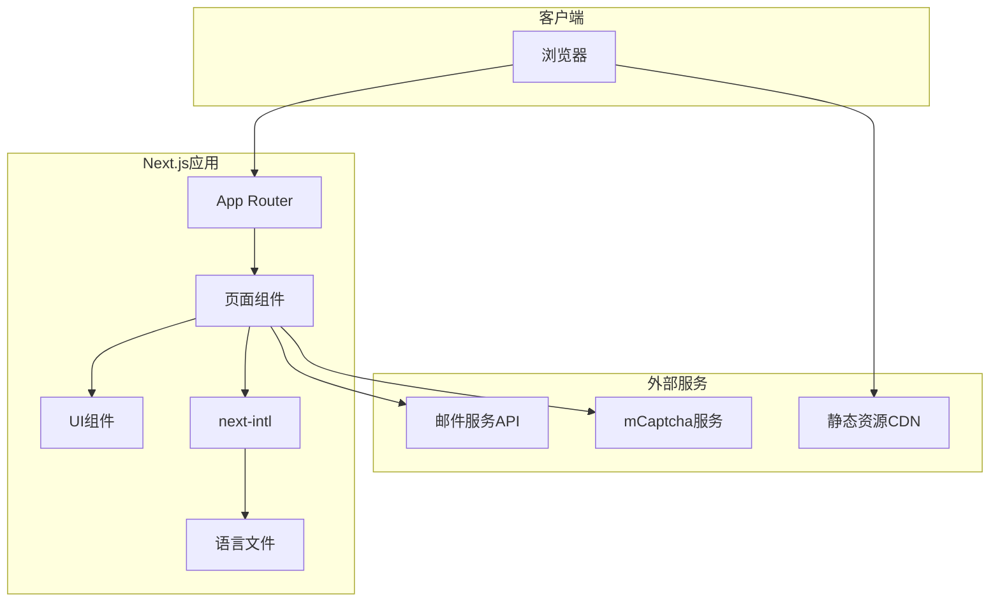

# 设计文档

## 概述

本设计文档描述Better Bags Myanmar背包OEM工厂独立站的技术架构和实现方案。网站采用单页滚动式（One-Page Scroll）海报风格设计，支持中英文国际化，使用Tailwind CSS构建响应式界面，遵循现代前端最佳实践。

### 技术栈选择

- **前端框架**: Next.js 14+ (App Router) - 支持SSG/SSR、内置i18n路由、优秀的SEO支持
- **样式框架**: Tailwind CSS 3.4+ - 原子化CSS、JIT编译、响应式设计
- **国际化**: next-intl - Next.js官方推荐的i18n解决方案
- **表单处理**: React Hook Form + Zod - 类型安全的表单验证
- **邮件服务**: Resend/SendGrid API - 表单提交通知
- **人机验证**: mCaptcha - 开源隐私友好的验证方案
- **部署平台**: Vercel - 与Next.js深度集成

## 架构

### 整体架构图



### 目录结构

```
/
├── app/
│   ├── [locale]/
│   │   ├── layout.tsx          # 根布局（含导航栏、页脚）
│   │   ├── page.tsx            # 首页（单页滚动）
│   │   └── blog/
│   │       ├── page.tsx        # 博客列表页
│   │       └── [slug]/
│   │           └── page.tsx    # 博客详情页
│   ├── api/
│   │   └── contact/
│   │       └── route.ts        # 表单提交API
│   └── globals.css             # 全局样式
├── components/
│   ├── layout/
│   │   ├── Navbar.tsx          # 导航栏
│   │   ├── Footer.tsx          # 页脚
│   │   └── LanguageSwitcher.tsx # 语言切换
│   ├── sections/
│   │   ├── HeroBanner.tsx      # 首页Banner
│   │   ├── AboutUs.tsx         # 关于我们
│   │   ├── Features.tsx        # 特色
│   │   ├── Services.tsx        # 服务流程
│   │   ├── FAQ.tsx             # 常见问题
│   │   ├── Contact.tsx         # 联系我们
│   │   └── Blog.tsx            # 博客预览
│   └── ui/
│       ├── Button.tsx          # 按钮组件
│       ├── Card.tsx            # 卡片组件
│       ├── Accordion.tsx       # 手风琴组件
│       └── Form/               # 表单组件
├── locales/
│   ├── zh.json                 # 中文翻译
│   └── en.json                 # 英文翻译
├── lib/
│   ├── i18n.ts                 # i18n配置
│   ├── utils.ts                # 工具函数
│   └── validations.ts          # 表单验证schema
├── public/
│   ├── images/                 # 图片资源
│   └── fonts/                  # 字体文件
├── tailwind.config.ts          # Tailwind配置
└── next.config.js              # Next.js配置
```

## 组件与接口

### 核心组件设计

#### 1. 导航栏组件 (Navbar)

```typescript
interface NavbarProps {
  locale: 'zh' | 'en';
  currentSection?: string;
}

interface NavItem {
  id: string;
  href: string;
  label: string;
}
```

功能：
- 固定定位在视口顶部
- 响应式汉堡菜单（<768px）
- 语言切换按钮
- 当前区块高亮指示
- 平滑滚动导航

#### 2. 区块容器组件 (Section)

```typescript
interface SectionProps {
  id: string;
  className?: string;
  fullHeight?: boolean;
  children: React.ReactNode;
}
```

功能：
- 统一的区块ID锚点
- 可选全屏高度（100vh/100svh）
- 响应式内边距

#### 3. 询价表单组件 (ContactForm)

```typescript
interface ContactFormData {
  firstName: string;
  lastName: string;
  email: string;
  countryRegion: string;
  companyName: string;
  phoneNumber: string;
  subject: string;
  estimatedQuantity: 'less-100' | '100-300' | '300-1000' | 'more-1000';
  hasTechPack: 'tech-pack' | 'physical-sample' | 'idea-sketch';
  files?: FileList;
  launchDate?: string;
  specialRequests?: string;
  message: string;
  captchaToken: string;
}

interface ContactFormProps {
  onSubmit: (data: ContactFormData) => Promise<void>;
  locale: 'zh' | 'en';
}
```

#### 4. FAQ手风琴组件 (Accordion)

```typescript
interface AccordionItem {
  question: string;
  answer: string;
}

interface AccordionSection {
  title: string;
  items: AccordionItem[];
}

interface AccordionProps {
  sections: AccordionSection[];
  allowMultiple?: boolean;
}
```

### API接口设计

#### 表单提交API

```typescript
// POST /api/contact
interface ContactRequest {
  firstName: string;
  lastName: string;
  email: string;
  countryRegion: string;
  companyName: string;
  phoneNumber: string;
  subject: string;
  estimatedQuantity: string;
  hasTechPack: string;
  launchDate?: string;
  specialRequests?: string;
  message: string;
  captchaToken: string;
  files?: string[]; // Base64编码的文件或文件URL
}

interface ContactResponse {
  success: boolean;
  message: string;
  submissionId?: string;
}
```

## 数据模型

### 语言文件结构 (locales/zh.json)

```typescript
interface LocaleData {
  nav: {
    home: string;
    about: string;
    features: string;
    services: string;
    faq: string;
    contact: string;
    blog: string;
  };
  banner: {
    line1: string;
    line2: string;
    p1: { pre: string; highlight: string; post: string };
    p2: string;
    p3: string;
    cta: string;
  };
  about: {
    title: string;
    mission: { title: string; desc: string };
    vision: { title: string; desc: string };
    valuesTitle: string;
    values: Array<{ title: string; desc: string }>;
    company: { title: string; p1: string; p2: string; p3: string; p4: string };
  };
  features: {
    stats: Array<{ label: string; value: string }>;
    jay: { title: string; desc1: string; and: string; desc2: string };
    title: string;
    list: Array<{ title: string; color: string; desc: string }>;
  };
  services: {
    title: string;
    steps: Array<{ title: string; desc: string }>;
  };
  faq: {
    title: string;
    sections: Array<{
      title: string;
      items: Array<{ q: string; a: string }>;
    }>;
  };
  contact: {
    address: { label: string; value: string };
    phone: { label: string; value: string };
    email: { label: string; value: string };
    whatsapp: { label: string; value: string };
  };
  footer: {
    companyInfo: { name: string; address: string; email: string; phone: string };
    quickLinks: string;
    hours: string;
    hoursTime: string;
    copyright: string;
  };
  form: {
    firstName: string;
    lastName: string;
    email: string;
    countryRegion: string;
    companyName: string;
    phoneNumber: string;
    subject: string;
    estimatedQuantity: string;
    quantityOptions: string[];
    hasTechPack: string;
    techPackOptions: string[];
    uploadFiles: string;
    launchDate: string;
    specialRequests: string;
    message: string;
    submit: string;
    required: string;
    success: string;
    error: string;
  };
}
```

### 博客文章数据模型

```typescript
interface BlogPost {
  slug: string;
  title: { zh: string; en: string };
  excerpt: { zh: string; en: string };
  content: { zh: string; en: string };
  coverImage: string;
  publishedAt: string;
  author: string;
  tags: string[];
}
```

## 正确性属性

*属性是系统在所有有效执行中应保持为真的特征或行为——本质上是关于系统应该做什么的形式化陈述。属性作为人类可读规范和机器可验证正确性保证之间的桥梁。*

### 属性 1: 语言切换一致性
*对于任意*语言切换操作，切换后页面上所有可翻译文本元素的内容应该与目标语言文件中的对应值一致。
**验证: 需求 2.2**

### 属性 2: 语言偏好持久化往返
*对于任意*语言选择，将语言偏好存储到localStorage后再读取，应该得到相同的语言代码。
**验证: 需求 2.4**

### 属性 3: 滚动位置保持
*对于任意*语言切换操作，切换前后的页面滚动位置（scrollY）差值应该在可接受的误差范围内（±10px）。
**验证: 需求 2.3**

### 属性 4: 导航锚点滚动
*对于任意*有效的导航链接点击，点击后页面应该滚动到对应区块的位置，使该区块的顶部位于视口顶部附近（考虑导航栏高度偏移）。
**验证: 需求 3.2, 3.5**

### 属性 5: 导航激活状态同步
*对于任意*滚动位置，当前可见区块对应的导航链接应该具有激活样式类，且只有一个链接处于激活状态。
**验证: 需求 3.3**

### 属性 6: 响应式汉堡菜单
*对于任意*视口宽度，当宽度小于768px时汉堡菜单按钮应该可见且导航链接列表隐藏，当宽度大于等于768px时汉堡菜单按钮应该隐藏且导航链接列表可见。
**验证: 需求 5.4**

### 属性 7: 字体大小响应式范围
*对于任意*视口宽度，正文字体计算后的大小应该在14px到18px的范围内。
**验证: 需求 4.2**

### 属性 8: 图片宽高比保持
*对于任意*图片元素和任意容器宽度变化，图片的宽高比应该保持不变。
**验证: 需求 4.5**

### 属性 9: FAQ手风琴交互
*对于任意*FAQ问题点击，点击后该问题的答案应该展开显示，且之前展开的其他答案应该折叠。
**验证: 需求 10.2, 10.3**

### 属性 10: 表单验证完整性
*对于任意*表单提交，如果任何必填字段为空或格式无效，表单应该阻止提交并显示对应字段的错误提示。
**验证: 需求 11.10**

### 属性 11: 表单提交成功处理
*对于任意*包含所有有效必填数据的表单提交，系统应该返回成功响应并显示确认消息。
**验证: 需求 11.9**

### 属性 12: 键盘焦点可见性
*对于任意*可交互元素获得键盘焦点时，该元素应该具有可见的焦点指示器样式。
**验证: 需求 5.5, 16.3**

### 属性 13: 页脚链接滚动
*对于任意*页脚快捷链接点击，点击后页面应该平滑滚动到对应区块的位置。
**验证: 需求 13.5**

## 错误处理

### 表单提交错误

| 错误类型 | 处理方式 |
|---------|---------|
| 必填字段为空 | 在字段下方显示红色错误提示，阻止提交 |
| 邮箱格式无效 | 显示"请输入有效的邮箱地址"提示 |
| 文件大小超限 | 显示"文件大小不能超过10MB"提示 |
| 文件类型不支持 | 显示"仅支持PDF、JPG、PNG格式"提示 |
| mCaptcha验证失败 | 显示"请完成人机验证"提示 |
| 网络错误 | 显示"网络连接失败，请稍后重试"提示 |
| 服务器错误 | 显示"提交失败，请稍后重试或直接联系我们"提示 |

### 语言加载错误

| 错误类型 | 处理方式 |
|---------|---------|
| 语言文件加载失败 | 回退到默认语言（英文） |
| 翻译键缺失 | 显示键名作为后备，控制台警告 |

### 图片加载错误

| 错误类型 | 处理方式 |
|---------|---------|
| 图片加载失败 | 显示占位图或品牌色背景 |
| 图片格式不支持 | 回退到JPEG/PNG格式 |

## 测试策略

### 双重测试方法

本项目采用单元测试和属性测试相结合的方式确保代码质量：

- **单元测试**: 验证特定示例和边界情况的正确行为
- **属性测试**: 验证应在所有输入上保持的通用属性

### 属性测试框架

使用 **fast-check** 作为属性测试库，配合 Vitest 测试框架。

### 测试配置

```typescript
// vitest.config.ts
import { defineConfig } from 'vitest/config';

export default defineConfig({
  test: {
    environment: 'jsdom',
    globals: true,
    setupFiles: ['./tests/setup.ts'],
  },
});
```

### 属性测试要求

- 每个属性测试必须运行至少100次迭代
- 每个属性测试必须用注释标注对应的正确性属性
- 格式: `// **Feature: backpack-oem-website, Property {number}: {property_text}**`

### 测试覆盖范围

| 测试类型 | 覆盖内容 |
|---------|---------|
| 单元测试 | 组件渲染、工具函数、表单验证 |
| 属性测试 | 语言切换、导航滚动、响应式布局、表单验证 |
| 集成测试 | 表单提交流程、API端点 |
| E2E测试 | 关键用户流程（可选） |

### 示例属性测试

```typescript
// **Feature: backpack-oem-website, Property 2: 语言偏好持久化往返**
import { fc } from 'fast-check';
import { describe, it, expect } from 'vitest';

describe('语言偏好持久化', () => {
  it('存储后读取应返回相同的语言代码', () => {
    fc.assert(
      fc.property(
        fc.constantFrom('zh', 'en'),
        (locale) => {
          localStorage.setItem('locale', locale);
          const stored = localStorage.getItem('locale');
          return stored === locale;
        }
      ),
      { numRuns: 100 }
    );
  });
});
```
